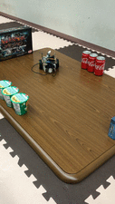

# 最終目標
### jetbot nanoを使った機械学習コンテンツの開発

## 8月29日までに行ったこと
・jetbotの家での動作確認

## 8月16日までに行ったこと
・jetbotの持ち帰りの準備

・機械学習の基本的な勉強を開始

## 8月8までに行ったこと
・ラグを改善するために無線から有線への変更

・教師データの収集が完了

## 8月1日までに行ったこと
・ライントレースの教師データの収集方法が間違っていることに気づいた

・再度収集を試みたが、通信が安定しない（ラグがすごい）ためデータの収集を断念

・上記の改善策を検討中

## 7月25日までに行ったこと
・ライントレースを行うためのデータの収集

## 7月18日までに行ったこと
・障害物回避のプログラムを動かした

・Jupyter notebookの使い方の勉強

・[こちらの記事](https://www.ogis-ri.co.jp/otc/hiroba/technical/lets-try-jetbot/part4.html)を参考にした

## 6月29日までに行ったこと
・pingコマンドの勉強

・donkey carの公式ドキュメントを確認
## 6月11日までに行ったこと
・pythonの基本的な文法の勉強

