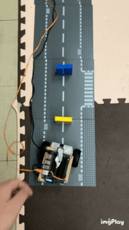
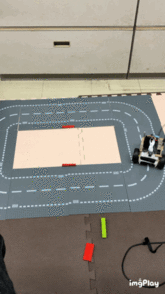
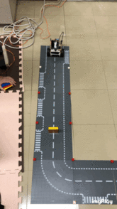
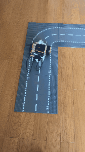

# 最終目標
### jetbot nanoを使った機械学習コンテンツの開発

## 教訓
・電源アダプタを接続した状態で`sudo nvpmodel -m 0`で20Wで動作でき、サクサク動く

## 11月14日に行ったこと
・三つの状況判断の制度が悪い

・改善予定

## 11月5日に行ったこと
・3つの状況判断ができるmodelの作成に成功

・下記のgif動画は、黄色いオブジェクトがあれば停止、青いオブジェクトがあれば左折、何もなければ直進という3つの状況判断を行っている

・

## 10月31日までに行ったこと
・softmax関数で障害物がある確率とない確率を配列にして返してきていることを確認した。

・次回までに、それぞれ別に取得できるのかを確認し、出力層を3つに増やして3つのobjectの判断を行ってみる予定。

## 10月24日までに行ったこと
・ゼロから作るDeep Learningの本を120ページくらいまで読んだ

## 10月17日までに行ったこと
・line_traceとcollision_stopを組み合わせた(line_stop)が完成した

## 10月10日に行ったこと
・今後は、line_traceとcollision_stopを組み合わせたものを作る

・line_traceの完了(下記の動画)

・下記の障害物があったら止まるプログラム(collision_stop)が完成した。(下記の動画)

・朝の時点で、障害物と認識した場合止まり障害物がなくなると進むプログラム（collision_stop_sample）が完成した。(下記の動画)

## 10月9日までに行ったこと
・障害物を発見したときに写真を撮るスクリプトの作成

・データの収集を試みるも、期待どおりの動作はしなかった

## 10月3日までに行ったこと
・横山君と知識の共有をした

## 9月26日までに行ったこと
・pytorchの勉強の開始

## 9月15日までに行ったこと
・[jetbotの基本](https://github.com/NVIDIA-AI-IOT/jetbot/blob/master/notebooks/basic_motion/basic_motion.ipynb)の勉強

・自宅pcにopencvの環境設定

## 9月6日までに行ったこと
・ライントレースのプログラムを動かすことができた。ただ、動作原理などはよくわかっていない。

・この前の衝突回避と今回のライントレースの動作原理を理解すると同時に、この二つを組み合わせたものを作る予定。

## 9月5日までに行ったこと
・卒業研究を本格的に開始

・[ライントレースのプログラム](https://www.ogis-ri.co.jp/otc/hiroba/technical/lets-try-jetbot/part4.html)を動かそうとしている段階

・モデルを作るためのデータの収集は終わりモデルを作成した。デモを行おうと思ったが思うように動かなかった。考えられる原因はとしては集めたデータが研究室で収集したものと自宅で収集したものが混じっていたため。あるいは、そもそもデータの質が悪かった。デモはまだ回数をこなせていない。

・I/Oエラー、カメラを認識しないエラーが頻発する。少しストレス

## 8月29日までに行ったこと
・jetbotの家での動作確認

## 8月16日までに行ったこと
・jetbotの持ち帰りの準備

・機械学習の基本的な勉強を開始

## 8月8までに行ったこと
・ラグを改善するために無線から有線への変更

・教師データの収集が完了

## 8月1日までに行ったこと
・ライントレースの教師データの収集方法が間違っていることに気づいた

・再度収集を試みたが、通信が安定しない（ラグがすごい）ためデータの収集を断念

・上記の改善策を検討中

## 7月25日までに行ったこと
・ライントレースを行うためのデータの収集

## 7月18日までに行ったこと
・障害物回避のプログラムを動かした

・Jupyter notebookの使い方の勉強

・[こちらの記事](https://www.ogis-ri.co.jp/otc/hiroba/technical/lets-try-jetbot/part4.html)を参考にした

## 6月29日までに行ったこと
・pingコマンドの勉強

・donkey carの公式ドキュメントを確認
## 6月11日までに行ったこと
・pythonの基本的な文法の勉強

